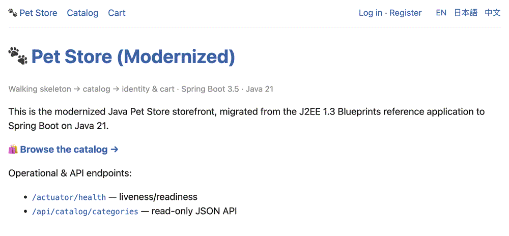
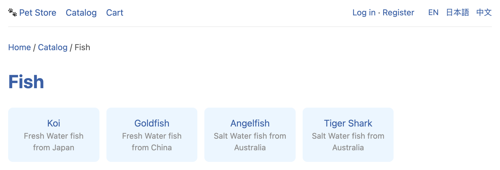
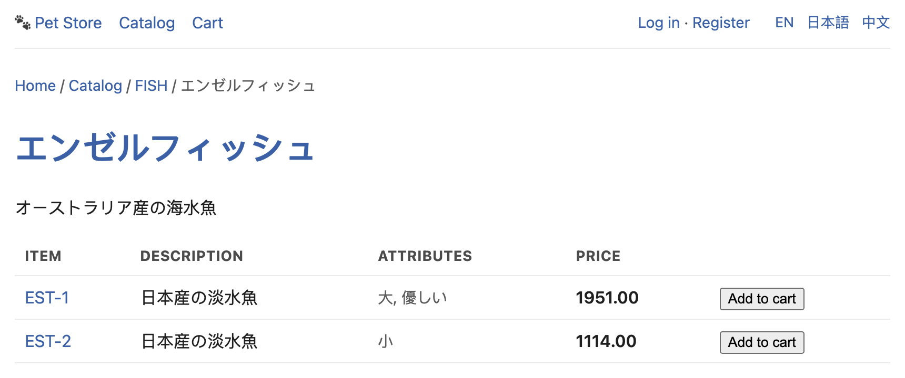

# Pet Store — Modernized (J2EE 1.3 → Spring Boot / Java 21)

A modernization of the classic **Java Pet Store 1.3.1** J2EE Blueprints storefront onto a
current, self-contained runtime: **Spring Boot 3.5 on Java 21**, with a **relational-first**
persistence layer and a **MongoDB** adapter behind the same domain ports (the stretch goal).

> Scope: the **consumer storefront** (`petstore.ear`) only — catalog browsing, shopping cart,
> sign-on/account, and checkout. The admin, supplier, and Order Processing Center (OPC) EARs are
> out of scope; the legacy asynchronous JMS hand-off to OPC is preserved as a documented seam
> (an outbound port with a local adapter). See [`docs/migration/`](docs/migration).



<sub>The Thymeleaf storefront: browsing the catalog, switching locale (EN / 日本語 / 中文), and a
product page — the same Spring Boot app that runs on H2, PostgreSQL, or MongoDB behind identical
ports.</sub>

---

## Why this exists

This is a migration *case study* as much as a running app. The emphasis is on **how** a legacy
system is broken into safely-shippable pieces — discovery, decomposition, an always-green
pipeline, characterization tests, and architecture decisions recorded as
[ADRs](docs/adr). If the legacy codebase were 100× larger, the same approach would scale.

- **As-is architecture:** [`docs/migration/as-is-architecture.md`](docs/migration/as-is-architecture.md)
- **Target architecture:** [`docs/migration/target-architecture.md`](docs/migration/target-architecture.md)
- **Migration approach & decomposition:** [`docs/migration/approach.md`](docs/migration/approach.md)
- **Risk register:** [`docs/migration/risk-register.md`](docs/migration/risk-register.md)
- **Decision log (ADRs):** [`docs/adr/`](docs/adr)

---

## Prerequisites

| Tool   | Version         | Notes                                             |
|--------|-----------------|---------------------------------------------------|
| JDK    | **21** (LTS)    | Temurin / OpenJDK. The build is pinned to Java 21. |
| Maven  | 3.9+            | Or use the bundled `mvnw` wrapper (added in Phase 0). |
| Docker | optional        | Only for the "prod-like" run (Postgres + MongoDB). Dev/test use embedded H2 + embedded Mongo, so Docker is **not required**. |

### macOS (Homebrew) quick setup

```bash
brew install openjdk@21 maven
export JAVA_HOME="/opt/homebrew/opt/openjdk@21/libexec/openjdk.jdk/Contents/Home"
export PATH="$JAVA_HOME/bin:$PATH"
java -version   # should print 21.x
```

---

## Build & run

```bash
# from the repository root
export JAVA_HOME="/opt/homebrew/opt/openjdk@21/libexec/openjdk.jdk/Contents/Home"   # macOS/brew

# run the test suite (unit + slice + context) — the always-green quality gate
mvn test

# run the app (default profile: embedded H2, schema + seed data auto-loaded)
mvn spring-boot:run
```

Then open:

- Storefront: <http://localhost:8080/>
- Health:     <http://localhost:8080/actuator/health>

### Persistence profiles

| Profile        | Datastore                     | Intended use                    |
|----------------|-------------------------------|---------------------------------|
| default        | H2 in-memory (dev) / Postgres | Faithful relational migration   |
| `mongo`        | MongoDB (real; embedded in tests) | Stretch goal — document model |

The default profile runs the JPA adapters (Flyway-managed schema + seed). The `mongo` profile
swaps **only the outbound persistence adapters** — the domain, use cases, web layer, and security
are untouched — proving the ports-and-adapters seams (ADR-0003/0004):

```bash
mvn spring-boot:run -Dspring-boot.run.profiles=mongo   # needs a MongoDB (see Docker Compose, Phase 6)
```

The Mongo catalog is seeded from `db/mongo/catalog-seed.json`, generated from the **same** legacy
XML as the relational seed by one tool with two emitters:

```bash
python3 tools/seed-import/extract_catalog_seed.py --format sql   > src/main/resources/db/migration/V2__catalog_seed.sql
python3 tools/seed-import/extract_catalog_seed.py --format mongo > src/main/resources/db/mongo/catalog-seed.json
```

Tests use **embedded MongoDB** (flapdoodle), so `mvn test` needs no external broker. The
`MongoPortParityTest` asserts the Mongo adapters reproduce the legacy catalog facts identically to
the JPA adapters, and `MongoAppFlowIntegrationTest` runs the whole storefront (register → login →
browse → checkout) on MongoDB.

### Prod-like run with Docker Compose

The same container image runs against either datastore — the hexagonal payoff made tangible. Pick
a Compose profile:

```bash
docker compose --profile relational up --build   # app + PostgreSQL (default JPA adapters)
docker compose --profile document   up --build   # app + MongoDB   (mongo-profile adapters)
```

Then open <http://localhost:8080/>. Tear down with `docker compose down -v`.

The app is a single executable jar (`java -jar target/*.jar`) or the provided multi-stage
`Dockerfile` (non-root, Actuator health-checked). Connection details are environment-driven
(`SPRING_DATASOURCE_URL`, `MONGODB_URI`); see [ADR-0007](docs/adr/0007-package-as-executable-jar-and-docker-compose.md).

### Demo script

With the app running (any datastore), drive the whole storefront — browse + i18n, register, log
in, add to cart, checkout through the OPC seam — in one go:

```bash
./scripts/demo.sh
```

### Screenshots

| Catalog (a category) | Product detail, localized to Japanese |
|---|---|
|  |  |

The legacy per-locale catalog (`en_US` / `ja_JP` / `zh_CN`) is preserved faithfully — names,
descriptions, **and** prices resolve per locale (note `¥`-scale prices `1951` / `1114` in the
Japanese view). More under [`docs/images/`](docs/images).

---

## Project structure

```
src/main/java/com/example/petstore
├── PetstoreApplication.java        # single Spring Boot entry point (replaces the WAF front controller + EJB container)
├── catalog/                        # bounded context: browse categories / products / items (Phase 2)
│   ├── domain/                     #   entities & value objects (framework-free)
│   ├── application/                #   use-case services + ports (interfaces)
│   └── adapter/{in/web,out/persistence}
├── cart/            identity/      order/      # further bounded contexts (Phases 3–4)
│                                   #   each: adapter/out/persistence/{jpa,mongo} behind one port
└── support/                        # cross-cutting: config, web, i18n
```

Each bounded context's outbound persistence has **two** adapters — `jpa` (default profile) and
`mongo` (`mongo` profile) — implementing the same port, selected by Spring profile (Phase 5).

The layout is **ports-and-adapters (hexagonal)**: the domain and use cases depend on *ports*
(interfaces); persistence and web live in *adapters*. This is what lets the same domain run
against either a JPA/relational adapter or a MongoDB adapter (see
[ADR-0003](docs/adr/0003-hexagonal-architecture-and-persistence-ports.md),
[ADR-0004](docs/adr/0004-relational-first-then-mongodb.md)).

---

## Testing

- **Unit** — domain logic, framework-free, fast.
- **Slice** — `@WebMvcTest`, `@DataJpaTest` for adapters.
- **Characterization** — assert migrated queries reproduce the legacy catalog data
  (seeded from the original `Populate-UTF8.xml`), guarding behavior parity.
- **Context** — `contextLoads()` smoke test; must always pass.

```bash
mvn test
```

---

## Migration status

| Phase | Scope                                   | Status |
|-------|-----------------------------------------|--------|
| 0     | Foundation, discovery, scaffolding      | ✅ done |
| 1     | Domain model & data layer               | ✅ done |
| 2     | Catalog slice (read-only)               | ✅ done |
| 3     | Identity & shopping cart                | ✅ done |
| 4     | Checkout & orders                       | ✅ done |
| 5     | MongoDB stretch goal                    | ✅ done |
| 6     | Hardening, publish, demo                | ✅ done |

---

## License

The original Java Pet Store is © Sun Microsystems under a BSD-style license (see the legacy
distribution). This modernization is a derivative educational work.
